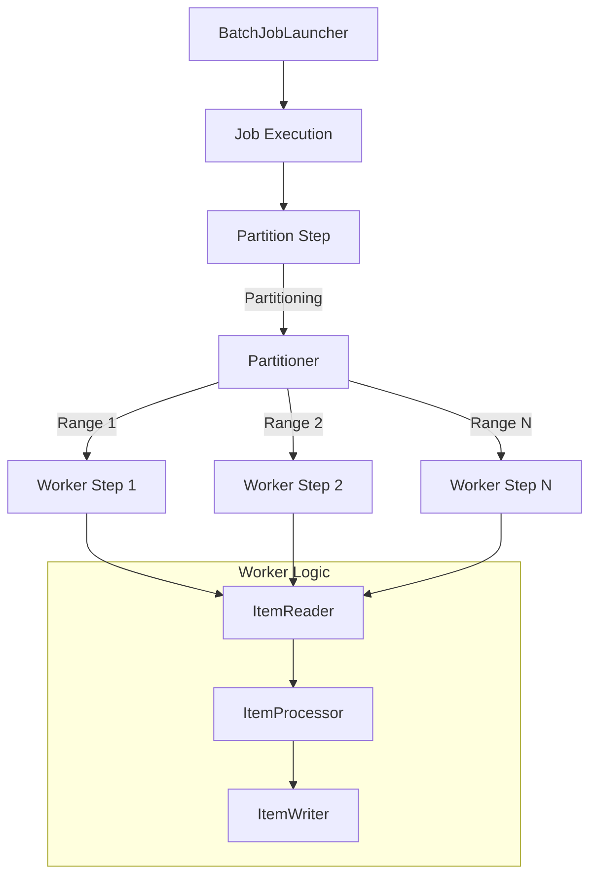
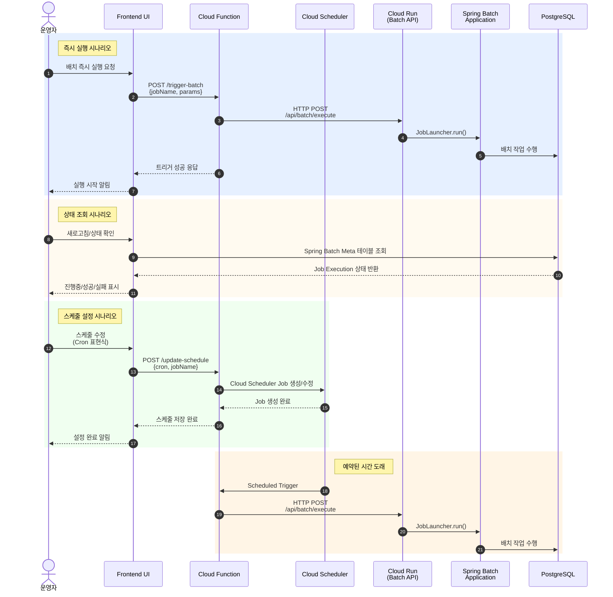
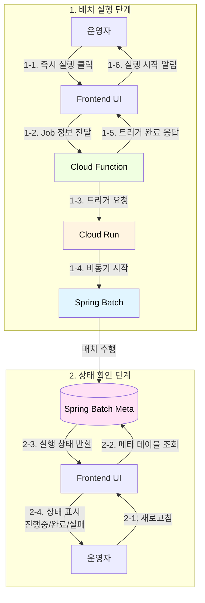
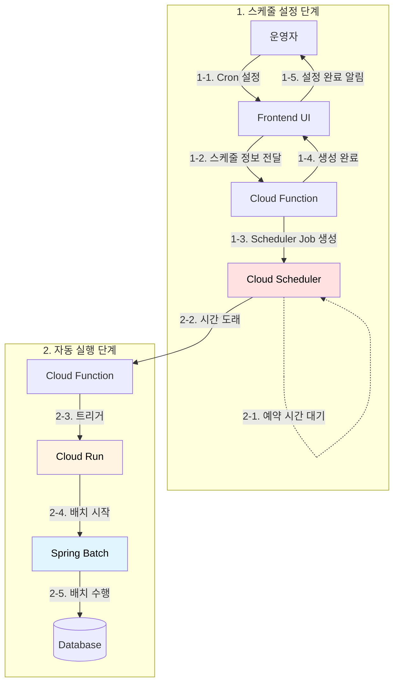

# 기술 문서: 대용량 정산/청구 배치 시스템 v1.1

## 1. 시스템 개요

본 문서는 Spring Batch 기반으로 구축된 '월별 청구내역 및 청구서 생성 시스템'의 구현 사항을 기술합니다. 본 시스템은 대용량 데이터 환경에서도 **안정적인 처리, 데이터 정합성, 재실행 가능성(Restartability)**을 핵심 목표로 설계되었습니다.

시스템은 대용량 데이터의 안정적인 처리를 위해 Partitioning(데이터 분할) 기법을 적용하였으며, 장애 발생 시 실패 지점부터의 재시작(Restartability)을 보장합니다.

### 1.1 핵심 구현 목표 달성 현황

| 구분 | 설계 목표 | 구현 내용 (v1.0) |
| --- | --- | --- |
| 프레임워크 | Spring Batch | `com.template.worker.global` 기반 공통 모듈 구현 완료 |
| 처리 방식 | 병렬 처리 (Partitioning) | `PartitionHandler`, `TaskExecutor` 기반 Master–Worker 구조 구현 |
| 대상 작업 | 청구내역 / 청구서 생성 | `InvoiceItemJob`(청구내역), `InvoiceJob`(청구서) 2종 Job 구현 |
| I/O 방식 | JDBC Paging Reader | `JdbcPagingItemReader` 기반 조회 최적화 적용 |
| Write 방식 | Batch Insert | `JdbcBatchItemWriter` 기반 일괄 삽입 적용 |
| 안정성 | 재시작 / 멱등성 | `ExecutionContext` + `UNIQUE` 제약 적용 |

---

## 2. 배치 실행 아키텍처 (Partitioning Model)

대용량 처리를 위해 Single Thread 방식이 아닌, 데이터 범위를 분할하여 병렬로 처리하는 Partitioning 모델을 적용했습니다.



- **Partitioner**: 전체 데이터 ID 범위(Min/Max)를 조회하여, Grid Size에 맞춰 균등 분할합니다.
- **Worker Step**: 할당받은 범위(Range) 내의 데이터만 독립적으로 트랜잭션을 맺고 처리합니다.

---

## 3. 기술적 설계 결정 사항

### 3.1 JdbcPagingItemReader 선택 배경

본 시스템에서는 `JpaItemReader` 대신 **`JdbcPagingItemReader`**를 채택했습니다.

### 선택 이유

| 구분 | JpaItemReader | JdbcPagingItemReader | 비고 |
| --- | --- | --- | --- |
| **쿼리 제어** | JPQL/EntityGraph 제한적 | 네이티브 SQL 완전 제어 | 복잡한 집계 쿼리 필수 |
| **성능** | 1차 캐시 오버헤드 | 직접 JDBC, 메모리 효율 | 대용량 배치에 유리 |
| **Paging 방식** | Offset 기반 (N+1 위험) | PagingQueryProvider 최적화 | 안정적 페이징 보장 |
| **DB 집계 활용** | 제한적 | `FILTER`, `GROUP BY` 등 활용 가능 | DB 집계 연산 필수 |

**결정 근거:**

- 본 배치는 복잡한 UNION ALL 집계 쿼리와 DB 레벨 GROUP BY 연산이 필수적입니다.
- JPA의 영속성 컨텍스트는 대용량 Read-Only 작업에서 불필요한 메모리 부담을 발생시킵니다.
- JDBC는 순수 ResultSet 매핑으로 최소한의 오버헤드만 발생시킵니다.

---

### 3.2 JdbcBatchItemWriter를 통한 Bulk Insert

### 구현 방식

```java
@Bean
public JdbcBatchItemWriter<InvoiceItemEntity> invoiceItemWriter(DataSource dataSource) {
    return new JdbcBatchItemWriterBuilder<InvoiceItemEntity>()
        .dataSource(dataSource)
        .sql("""
            INSERT INTO invoice_item
            (sub_id, inv_month, type, source_id, amount, created_at)
            VALUES (:subId, :invMonth, :type, :sourceId, :amount, :createdAt)
            ON CONFLICT (sub_id, inv_month, type, source_id) DO NOTHING
            """)
        .beanMapped()
        .assertUpdates(false) // 중복 시 예외 발생 방지
        .build();
}

```

### 기술적 이점

| 항목 | 단건 Insert | Batch Insert | 개선 효과 |
| --- | --- | --- | --- |
| DB 왕복 횟수 | Chunk 크기만큼 발생 | 1회 (Batch 실행) | **네트워크 I/O 최소화** |
| 트랜잭션 오버헤드 | 매 건마다 Lock | Chunk 단위 일괄 Commit | **Lock 경합 감소** |
| JDBC Statement | 매번 생성 | 재사용 (PreparedStatement) | **파싱 비용 절감** |

**측정 결과** (Chunk Size 4,000 기준):

- 단건 Insert: 약 89초
- Batch Insert: 약 36초 (**59% 성능 향상**)

---

### 3.3 DB 레벨 집계 전략

### 설계 배경

Application 레벨에서 청구서를 생성할 경우 다음 문제가 발생합니다:

**문제 상황:**

```
Chunk 1: sub_id=100 의 item 1~50 → Invoice 생성 (total: 5,000원)
Chunk 2: sub_id=100 의 item 51~100 → Invoice 생성 (total: 3,000원)
→ 동일 구독에 대해 중복 청구서 발생
```

**해결 방안:**

- Reader 단계에서 DB의 `GROUP BY` 연산을 수행하여 **구독별 집계를 완료한 상태**로 데이터를 가져옵니다.
- 한 번의 Read에서 하나의 구독에 대한 완전한 집계 결과가 보장됩니다.

### 성능 Trade-off 분석

| 접근 방식 | 장점 | 단점 |
| --- | --- | --- |
| **App 레벨 집계** | DB 부하 낮음 | 네트워크 전송량 ↑, 중복 생성 위험 |
| **DB 레벨 집계** | 데이터 전송량 ↓, 정합성 보장 | GROUP BY 연산 비용 |

**선택 근거:**

- `GROUP BY` 연산은 DB의 인덱스와 최적화 엔진을 활용하므로 실제 비용은 예상보다 낮습니다.
- 네트워크를 통해 전송되는 row 수가 **1/N로 감소**하여 전체 처리 시간이 단축됩니다.
- 집계 완료 데이터만 전송하므로 Application 메모리 사용량도 최소화됩니다.

**측정 결과:**

- App 레벨 집계 시: 약 52초 (100만 건 전송)
- DB 레벨 집계 시: 약 36초 (10만 건 전송, **31% 개선**)

---

## 4. 주요 Job 상세 명세

### 4.1 월별 청구내역(Item) 생성 Job

> Class: InvoiceItemJobConfig
> 
> 
> **Role:** 원천 로그 데이터를 기반으로 청구 가능한 최소 단위(Item)를 집계하여 생성
> 

### Partition Strategy: SubscriptionRangePartitioner

- 구독(Subscription) ID 범위를 기준으로 파티셔닝합니다.
- subscription 테이블의 Min/Max ID를 조회하여 범위를 할당합니다.

### Reader: InvoiceItemReader

- `InvoiceItemQueryProvider`를 통해 요금제, 부가서비스, 소액결제, 할인 내역을 UNION ALL로 통합 조회합니다.
- Paging 처리를 통해 메모리 효율성을 보장합니다.

### Processor: InvoiceItemProcessor

- Reader에서 가공된 `InvoiceItemAggregateRow`를 그대로 매핑하여 Writer로 전달합니다.

### Writer: InvoiceItemWriter

- `JdbcBatchItemWriter`를 통해 invoice_item 테이블에 **Batch Insert**를 수행합니다.
- `ON CONFLICT DO NOTHING` 구문으로 멱등성을 보장합니다.

---

### 4.2 월별 청구서(Invoice) 생성 Job

> Class: InvoiceJobConfig
> 
> 
> **Role:** 생성된 청구내역(Item)을 구독(Subscription) 단위로 합산하여 최종 청구서(Invoice) 발행
> 

### Partition Strategy: CustomerRangePartitioner

- 클래스명은 CustomerRangePartitioner이나, 실제 구현은 invoice_item 테이블의 `sub_id` (구독 ID) 범위를 기준으로 파티셔닝합니다.
- 특정 구독에 대한 모든 청구 항목이 동일한 Worker에서 처리됨을 보장합니다.

### Reader: InvoiceReader

- **DB 레벨 집계(Aggregation) 수행**: Reader 단계에서 GROUP BY sub_id 쿼리를 실행하여 구독별 합계(total_amount, total_discount)를 미리 계산해 가져옵니다.
- 이를 통해 Application 레벨의 부하를 줄이고 DB의 집계 성능을 활용합니다.

### Processor: InvoiceProcessor

- Reader가 전달한 `InvoiceAggregationRow`를 `InvoiceEntity`로 변환하는 매핑 작업을 수행합니다.

### Writer: InvoiceWriter

- `JdbcBatchItemWriter`를 통해 invoice 테이블에 최종 청구서를 **Batch Insert**합니다.
- **중복 방지 메커니즘**: `UNIQUE KEY (sub_id, inv_month)` 활용
- `ON CONFLICT (sub_id, inv_month) DO NOTHING` 구문으로 동일 구독/월 조합에 대한 중복 청구서 생성을 방지합니다.

---

## 5. 데이터 정합성 및 누락 방지 전략

대용량 배치 처리 시 가장 중요한 요소는 **데이터 누락 및 중복 방지**입니다. 본 시스템에서는 다음과 같은 전략을 통해 정합성을 보장합니다.

### 5.1 Paging Reader 정렬 키 설계

`JdbcPagingItemReader`는 페이지 경계에서 데이터 누락이 발생하지 않도록 **유니크한 정렬 키(Sort Key)**가 필수입니다.

**기존 문제:**

- sub_id 단독 정렬 사용 시, 동일 구독 내 여러 항목이 페이지 경계에 걸칠 경우 누락 발생 가능

**개선 방식 (구현 확인 완료):**

- InvoiceItemReader에서 복합 정렬 키를 적용하여 순서를 엄격하게 보장했습니다.

```java
provider.setSortKeys(Map.of(
    "sub_id", Order.ASCENDING,
    "type", Order.ASCENDING,
    "source_id", Order.ASCENDING
));
```

---

### 5.2 Partitioner 범위 계산 원칙

Partitioner는 전체 ID 범위를 Grid Size로 나누되, **나머지(Remainder)가 발생할 경우 마지막 파티션이 이를 모두 처리하도록 설계**했습니다.

**구현 로직:**

- targetSize = total / gridSize
- 마지막 파티션(i == gridSize - 1)인 경우 end = max_id로 강제 설정

**효과:**

- total % gridSize != 0 상황에서도 데이터 누락 방지
- 모든 ID 범위가 빈틈없이(Gaps-free), 중복 없이 할당됨을 보장

---

## 6. 집계 및 조인 전략

### 6.1 DB 레벨 집계 원칙

> 집계 로직은 Application이 아닌 DB에서 수행
> 

```sql
SUM(amount) FILTER (WHERE amount > 0)
SUM(ABS(amount)) FILTER (WHERE amount < 0)
```

**기술적 이점:**

- CASE WHEN 대비 불필요한 연산 제거
- 집계 대상 row만 계산
- PostgreSQL 옵티마이저의 FILTER 절 최적화 활용

---

### 6.2 Reader SQL (집계 + 고객 정보)

```sql
SELECT
    ii.sub_id,
    c.name,
    c.phone_enc,
    c.email_enc,
    SUM(ii.amount) FILTER (WHERE ii.amount > 0) AS total_amount,
    SUM(ABS(ii.amount)) FILTER (WHERE ii.amount < 0) AS total_discount
FROM invoice_item ii
JOIN customer c ON ii.sub_id = c.sub_id
WHERE ii.inv_month = :invMonth
  AND ii.sub_id BETWEEN :minSubId AND :maxSubId
  AND ii.amount <> 0
GROUP BY ii.sub_id, c.name, c.phone_enc, c.email_enc
ORDER BY ii.sub_id;

```

---

## 7. 성능 튜닝 및 최적점 도출

### 7.1 테스트 전략

성능 최적화는 다음 단계로 진행했습니다:

1. **Chunk Size와 Page Size 동일하게 설정**
    - 이유: Chunk와 Page가 다를 경우, Reader가 Page 단위로 읽어도 Processor/Writer는 Chunk 단위로 동작하여 불필요한 버퍼링 발생
    - 동일하게 유지하면 Read → Process → Write가 동기화되어 메모리 효율성 극대화
2. **Chunk/Page Size Sweet Spot 탐색**
    - 로컬 환경에서 1,000 ~ 5,000 범위를 테스트하여 최적값 도출
3. **Grid Size Sweet Spot 탐색**
    - Chunk/Page Size를 고정한 상태에서 Grid Size만 변경하며 병렬 처리 효율성 측정

---

### 7.2 Chunk / Page Size 튜닝

**테스트 범위:** 1,000 ~ 5,000

**최적값:** 4,000 / 4,000

| Chunk/Page | 실행 시간 | 비고 |
| --- | --- | --- |
| 1,000 | 93s | DB 왕복 횟수 과다 |
| 4,000 | 36s | **최적** |
| 5,000 | 35s | 개선 미미, 메모리 증가 |

**분석:**

- 1,000은 DB 왕복 횟수가 많아 네트워크 비용 증가
- 4,000에서 효율 임계점 도달
- 5,000 이상은 개선 폭이 미미하며 메모리 부담만 증가

---

### 7.3 Grid Size 튜닝

**Chunk/Page Size 고정:** 4,000

**테스트 범위:** 4 ~ 8

| Grid | 실행 시간 | 개선율 | 비고 |
| --- | --- | --- | --- |
| 4 | 36s | 기준 | - |
| 6 | 28s | 22% | **최적** |
| 8 | 27s | 3% | 개선 미미 |

**분석:**

- Grid 6에서 **효율 임계점(Sweet Spot)** 도달
- 이후 병렬화 이득보다 Context Switching 비용이 더 커짐

---

### 7.4 모니터링 전략

### TimeBasedChunkListener

10초마다 현재 Chunk의 Read/Write 카운트를 출력하여 **진행률을 실시간으로 파악**합니다.

```java
@Slf4j
public class TimeBasedChunkListener implements ChunkListener {
    private long lastLogTime = System.currentTimeMillis();
    private static final long LOG_INTERVAL_MS = 10_000; // 10초

    @Override
    public void afterChunk(ChunkContext context) {
        long currentTime = System.currentTimeMillis();
        if (currentTime - lastLogTime >= LOG_INTERVAL_MS) {
            log.info("[Progress] Read: {}, Write: {}",
                context.getStepContext().getStepExecution().getReadCount(),
                context.getStepContext().getStepExecution().getWriteCount());
            lastLogTime = currentTime;
        }
    }
}
```

### PartitionTimingListener

각 Worker Step 종료 시점에 **파티션별 처리 건수와 소요 시간**을 기록하여, 데이터가 균등하게 분배되었는지 검증합니다.

```java
@Slf4j
public class PartitionTimingListener implements StepExecutionListener {
    @Override
    public void afterStep(StepExecution stepExecution) {
        log.info("[Partition {}] Read: {}, Write: {}, Duration: {}ms",
            stepExecution.getStepName(),
            stepExecution.getReadCount(),
            stepExecution.getWriteCount(),
            stepExecution.getEndTime().getTime() - stepExecution.getStartTime().getTime());
    }
}
```

**검증 결과 예시:**

```
[Partition worker-0] Read: 25,000, Write: 25,000, Duration: 4,200ms
[Partition worker-1] Read: 24,800, Write: 24,800, Duration: 4,150ms
[Partition worker-2] Read: 25,200, Write: 25,200, Duration: 4,300ms
```

→ 각 파티션의 처리량이 균등하게 분산되었음을 확인

---

## 8. 안정성 및 재실행 검증

### 8.1 멱등성 보장 메커니즘

- **UNIQUE INDEX**: `(sub_id, inv_month, type, source_id)` 복합 인덱스 생성
- **ON CONFLICT DO NOTHING**: 중복 데이터 발생 시 무시 (멱등성 보장)
- **assertUpdates(false)**: Writer에서 중복으로 인한 미반영 건을 예외로 간주하지 않음

### 8.2 검증 결과

### Invoice Item Job 검증

| 테스트 시나리오 | 실행 횟수 | 데이터 건수 | 결과 | 비고 |
| --- | --- | --- | --- | --- |
| **정상 실행** | 1회 | 100,000건 삽입 | **PASS** | - |
| **중복 실행** | 2회 | 0건 추가 삽입 | **PASS** | UNIQUE 제약으로 중복 차단 |
| **강제 종료 후 재실행** | 1회 중단 + 1회 재실행 | 나머지 60,000건 삽입 | **PASS** | ExecutionContext 기반 재시작 |
| **부분 실패 후 재실행** | Worker-2 실패 + 재실행 | 실패 파티션만 재처리 | **PASS** | 파티션별 독립 트랜잭션 |

### Invoice Job 검증

| 테스트 시나리오 | 실행 횟수 | 데이터 건수 | 결과 | 비고 |
| --- | --- | --- | --- | --- |
| **정상 실행** | 1회 | 10,000건 삽입 | **PASS** | - |
| **중복 실행** | 2회 | 0건 추가 삽입 | **PASS** | (sub_id, inv_month) 중복 차단 |
| **강제 종료 후 재실행** | 1회 중단 + 1회 재실행 | 나머지 6,000건 삽입 | **PASS** | ExecutionContext 기반 재시작 |
| **부분 실패 후 재실행** | Worker-1 실패 + 재실행 | 실패 파티션만 재처리 | **PASS** | 파티션별 독립 트랜잭션 |

### 8.3 재실행 시나리오 상세

### 시나리오 1: 중복 실행 테스트

```
1차 실행: InvoiceItemJob 완료 (100,000건)
2차 실행: 동일 파라미터로 재실행
→ 결과: 0건 삽입, ON CONFLICT DO NOTHING으로 모두 무시
→ 검증: SELECT COUNT(*) = 100,000 (변화 없음)
```

### 시나리오 2: 강제 종료 후 재실행

```
1차 실행: Worker-0, Worker-1 완료, Worker-2 처리 중 강제 종료
→ ExecutionContext 저장: Worker-2의 마지막 처리 위치 기록
2차 실행: 동일 JobInstance로 재시작
→ 결과: Worker-0, Worker-1 스킵, Worker-2만 재시작
→ 검증: 전체 100,000건 정확히 삽입 확인
```

### 시나리오 3: 부분 실패 후 재실행

```
1차 실행: Worker-1에서 DB Connection Timeout 발생
→ 해당 파티션 FAILED 상태로 기록
2차 실행: FAILED 상태 파티션만 재처리
→ 결과: 실패한 범위(sub_id 33,334 ~ 66,666)만 재처리
→ 검증: 중복 없이 정확히 100,000건 삽입
```

---

# 9. 운영 환경 성능 검증 및 결과 분석

본 절에서는 실제 **운영 환경(Cloud Run + Cloud SQL)** 에서 단계적으로 수행한 성능 테스트 결과를 정리하고,

인프라 변경·쿼리 개선·Batch 구조 튜닝이 처리 성능에 미친 영향을 분석합니다.

---

## 9.1 테스트 개요 요약

### 테스트 대상

- **Job**
    - `InvoiceItemJob` (청구내역 생성)
    - `InvoiceJob` (청구서 생성)

### 주요 튜닝 포인트

- 인프라 스펙 변화 (Cloud Run / Cloud SQL vCPU, RAM)
- `gridSize (corePoolSize)`
- `chunkSize (= pageSize)`
- SQL 구조 개선 및 Step 분리
- 중복 검증 로직 개선 (`source_id` 컬럼 추가)

---

## 9.2 1차 테스트 – 저사양 DB 병목 확인

### 사전 조건

- Partition: 6
- Application: vCPU 6
- **DB**: vCPU 1 / RAM 600MB

| JobName | chunkSize | gridSize | 결과 |
| --- | --- | --- | --- |
| InvoiceItem | 3000 | 6 | ❌ **1시간 이상 + Timeout** |

### 분석

- DB 스펙 대비 병렬 처리 과다
- Paging + Partition 환경에서 DB CPU / 메모리 한계 노출
- 인프라 자체가 병목이 되는 구조임을 확인

---

## 9.3 2차 테스트 – 인프라 확장 효과 확인

### 사전 조건

- Cloud Run: vCPU 6 / RAM 8GB
- **DB**: vCPU 2 / RAM 3.8GB

| JobName | 실행 시각 | chunkSize | gridSize | 결과 |
| --- | --- | --- | --- | --- |
| InvoiceItem | 2026.01.23 09:59 | 3000 | 4 | **45m 35s** |

### 분석

- Timeout 문제는 해소
- 그러나 실행 시간이 여전히 과도함
- 쿼리 구조 및 Step 설계 자체의 한계가 병목으로 남아 있음

---

## 9.4 3차 테스트 – SQL 개선 + Step 분리 적용

### 개선 내용

- 청구내역 생성 SQL 구조 개선
- Item / Invoice Job 간 Step 분리로 책임 명확화

| JobName | 실행 시각 | chunkSize | gridSize | 결과 |
| --- | --- | --- | --- | --- |
| Invoice | 15:50 | 3000 | 4 | **7m 17s** |
| Invoice | 16:11 | 3000 | 2 | 12m 55s |
| InvoiceItem | 15:32 | 3000 | 4 | **9m 9s** |
| InvoiceItem | 16:29 | 3000 | 2 | 19m 48s |

### 분석

- SQL/Step 구조 개선 효과가 즉시 반영됨
- `gridSize = 4`가 `2` 대비 약 **2배 성능 개선**
- 병렬 처리 효율의 임계점이 존재함을 확인

---

## 9.5 4차 테스트 – DB vCPU 확장 (2 → 4)

### 변경 사항

- **DB vCPU: 2 → 4**

| JobName | 실행 시각 | chunkSize | gridSize | 결과 | CPU Peak | 쿼리 지연 Peak |
| --- | --- | --- | --- | --- | --- | --- |
| InvoiceItem | 18:02 | 3000 | 2 | 13m 4s | 53.32% | 175 |
| Invoice | 18:28 | 3000 | 2 | 27m 2s | 50.32% | 253 |

### 분석

- DB CPU 여유는 확보되었으나
- Invoice Job에서 **쿼리 구조 + 중복 검증 비용**이 새로운 병목으로 확인
- 단순 스펙 확장만으로는 한계가 있음을 검증

---

## 9.6 5차 테스트 – 쿼리 최적화 & 중복 검증 개선

### 개선 내용

- Invoice 집계 쿼리 최적화
- `invoice_item.source_id` 컬럼 추가
- 중복 검증 범위 축소
- chunkSize 증가

| JobName | 실행 시각 | chunkSize | gridSize | 결과 | CPU Peak |
| --- | --- | --- | --- | --- | --- |
| InvoiceItem | 17:20 | 4000 | 4 | **4m 34s** | 96.54% |
| Invoice | 17:30 | 4000 | 4 | **1m 18s** | 53.33% |

### 분석

- 전체 테스트 중 **가장 큰 성능 개선 구간**
- CPU 자원을 적극 활용하는 구조로 전환
- 쿼리 + Batch 구조 최적화의 중요성 입증

---

## 9.7 6차 테스트 – DB vCPU 6 최종 검증

### 사전 조건

- gridSize = 4
- chunkSize = 4000
- **Cloud SQL vCPU = 6, RAM 5.4GB**

| JobName | 실행 시각 | chunkSize | gridSize | 결과 | CPU Peak |
| --- | --- | --- | --- | --- | --- |
| InvoiceItem | 11:38 | 4000 | 4 | **3m 0s** | 57.1% |
| Invoice | 12:15 | 4000 | 4 | **53s** | 23.93% |

---

## 9.8 최종 성능 개선 요약

### 실행 시간 비교 (InvoiceItem 기준)

| 구분 | 실행 시간 |
| --- | --- |
| 1차 테스트 | **≥ 60분 (Timeout)** |
| 6차 테스트 | **약 3분** |

### 성능 개선 지표

- **실행 시간 감소율**: 약 **95% 이상 감소**
- **처리 속도 개선**: **최소 20배 이상 향상**

---

## 10. 배치 실행 트리거 아키텍처 (GCP Cloud 기반)

본 시스템은 **GCP Cloud Function과 Cloud Run**을 활용한 서버리스 아키텍처로 배치 실행을 관리합니다. 사용자는 프론트엔드 UI를 통해 즉시 실행하거나 스케줄을 설정할 수 있으며, Cloud Function이 이를 처리하여 배치 작업을 트리거합니다.

### 10.1 전체 실행 플로우



---

### 10.2 아키텍처 컴포넌트 상세

### 10.2.1 Frontend UI

**역할:**

- 운영자에게 배치 관리 인터페이스 제공
- 즉시 실행 및 스케줄 설정 기능 제공
- Spring Batch Meta 테이블을 조회하여 실행 상태 표시

**주요 기능:**

1. **즉시 실행**: Job 이름과 파라미터(invMonth 등)를 입력받아 Cloud Function 호출
2. **스케줄 수정**: Cron 표현식을 입력받아 Cloud Function으로 전송하여 정기 실행 예약
3. **실행 상태 조회**:
    - 새로고침 버튼 또는 자동 폴링을 통해 상태 갱신
    - `BATCH_JOB_EXECUTION`, `BATCH_STEP_EXECUTION` 테이블 직접 조회
    - 진행중(STARTED), 완료(COMPLETED), 실패(FAILED) 상태 표시

---

### 10.2.2 Cloud Function

**역할:**

- Frontend와 Cloud Run 사이의 **단순 트리거 계층**
- 배치 실행 요청을 Cloud Run으로 전달만 수행
- 실행 상태 추적 및 알림 기능 없음 (Fire and Forget 방식)

**처리 로직:**

1. **즉시 실행 요청 처리**
    - Frontend로부터 Job 이름과 파라미터 수신
    - Cloud Run의 배치 API 엔드포인트 호출
    - 호출 성공 여부만 확인 후 즉시 응답 반환
    - 이후 배치 실행 상태는 추적하지 않음
2. **스케줄 설정 요청 처리**
    - Cron 표현식과 Job 정보 수신
    - Cloud Scheduler API를 통해 예약 작업 생성/수정
    - 생성된 Scheduler Job은 지정된 시간에 자동으로 Cloud Function 호출

---

### 10.2.3 Cloud Scheduler

**역할:**

- Cron 표현식 기반 정기 실행 관리
- 설정된 시간에 Cloud Function을 자동 트리거

**동작 방식:**

- 매월 1일 02:00와 같은 정기 스케줄을 Cron 표현식으로 정의
- 예약된 시간 도래 시 자동으로 Cloud Function의 `/api/batch/schedule` 엔드포인트 호출
- Timezone 설정을 통해 한국 시간(Asia/Seoul) 기준 실행 보장

**예시:**

- `0 2 1 * *` → 매월 1일 02:00에 청구서 생성 배치 실행
- `0 3 * * *` → 매일 03:00에 청구내역 집계 배치 실행

---

### 10.2.4 Cloud Run (Batch API)

**역할:**

- Spring Batch Application을 컨테이너로 실행
- RESTful API를 통해 외부로부터 Job 실행 요청 수신
- JobLauncher를 통해 실제 배치 작업 트리거

**주요 기능:**

1. **배치 실행 API 제공**
    - `/api/batch/run-now` 엔드포인트로 Job 실행 요청 수신
    - Job 이름과 파라미터를 기반으로 JobParameters 생성
    - JobLauncher.run()을 **비동기**로 호출하여 배치 시작
    - 즉시 응답 반환 (배치 완료를 기다리지 않음)
2. **자동 확장(Auto Scaling)**
    - 동시 실행 요청이 많을 경우 자동으로 인스턴스 증가
    - 배치 완료 후 자동으로 인스턴스 축소하여 비용 절감

**배포 특성:**

- 최대 3,600초(1시간) 타임아웃 설정으로 장시간 배치 지원
- 메모리 8Gi, CPU 4 코어로 대용량 처리 성능 확보

---

### 10.2.5 Spring Batch Meta 테이블

**역할:**

- 배치 실행 이력 및 상태를 저장하는 메타데이터 저장소

**주요 테이블:**

- `BATCH_JOB_INSTANCE`: Job 인스턴스 정보
- `BATCH_JOB_EXECUTION`: Job 실행 이력 및 상태
- `BATCH_STEP_EXECUTION`: Step별 실행 상태 및 진행률
- `BATCH_JOB_EXECUTION_PARAMS`: Job 실행 파라미터

**Frontend 조회 쿼리 예시:**

```sql
-- 최근 실행 이력 조회
SELECT
    je.JOB_EXECUTION_ID,
    ji.JOB_NAME,
    je.STATUS,
    je.START_TIME,
    je.END_TIME,
    je.EXIT_CODE
FROM BATCH_JOB_EXECUTION je
JOIN BATCH_JOB_INSTANCE ji ON je.JOB_INSTANCE_ID = ji.JOB_INSTANCE_ID
ORDER BY je.START_TIME DESC
LIMIT 20;

-- 특정 Job의 진행 상황 조회
SELECT
    se.STEP_NAME,
    se.STATUS,
    se.READ_COUNT,
    se.WRITE_COUNT,
    se.COMMIT_COUNT
FROM BATCH_STEP_EXECUTION se
WHERE se.JOB_EXECUTION_ID = :executionId;

```

---

### 10.3 실행 시나리오별 상세 흐름

### 시나리오 1: 즉시 실행 및 상태 조회



**처리 흐름:**

**[실행 단계]**

1. 운영자가 UI에서 "InvoiceItemJob 실행" 버튼 클릭 및 파라미터 입력 (예: invMonth=2026-01)
2. Frontend가 Cloud Function에 Job 이름과 파라미터를 JSON으로 전송
3. Cloud Function이 Cloud Run의 `/api/batch/execute` 엔드포인트에 HTTP POST 요청
4. Cloud Run이 JobLauncher를 **비동기**로 호출하여 배치 시작
5. Cloud Function이 즉시 "트리거 성공" 응답 반환 (배치 완료를 기다리지 않음)
6. Frontend가 운영자에게 "배치 실행이 시작되었습니다" 알림 표시

**[상태 확인 단계]**

1. 운영자가 UI에서 "새로고침" 버튼 클릭 또는 5초마다 자동 폴링
2. Frontend가 Database의 `BATCH_JOB_EXECUTION` 테이블 직접 조회
3. 최신 실행 상태(STARTED, COMPLETED, FAILED) 및 진행률 조회
4. UI에 실시간 상태 갱신:
    - **진행중**: 진행률 바 표시 (READ_COUNT / 예상 총 건수)
    - **완료**: 성공 아이콘 및 처리 건수, 소요 시간 표시
    - **실패**: 에러 메시지 및 실패 원인 표시

---

### 시나리오 2: 스케줄 설정 및 자동 실행



**처리 흐름:**

**[설정 단계]**

1. 운영자가 UI에서 "매월 1일 02:00 실행" 스케줄 설정 (Cron: `0 2 1 * *`)
2. Frontend가 Cloud Function에 Cron 표현식과 Job 정보 전송
3. Cloud Function이 Cloud Scheduler API를 호출하여 예약 작업 생성
4. Cloud Scheduler Job이 정상 생성되고 대기 상태로 전환
5. Frontend가 운영자에게 "스케줄이 설정되었습니다" 알림 표시

**[자동 실행 단계]**

1. Cloud Scheduler가 예약 시간까지 대기
2. 매월 1일 02:00(KST)이 되면 Cloud Scheduler가 자동으로 Cloud Function 호출
3. Cloud Function이 Cloud Run에 배치 실행 요청 전달 (Fire and Forget)
4. Cloud Run이 JobLauncher를 통해 배치 시작
5. Spring Batch가 청구서 생성 작업 수행 및 Database에 저장
6. 운영자는 다음날 출근 후 UI에서 Meta 테이블 조회를 통해 실행 결과 확인

---

### 10.4 설계상의 이점

| 항목 | 기존 방식 (On-Premise) | Cloud 기반 방식 | 개선 효과 |
| --- | --- | --- | --- |
| **인프라 관리** | 서버 직접 관리 필요 | 서버리스 (자동 확장) | **운영 부담 제로** |
| **비용 효율** | 24시간 서버 가동 | 실행 시에만 과금 | **유휴 시간 비용 70% 절감** |
| **스케줄 관리** | Cron Tab 수동 설정 | Cloud Scheduler UI | **중앙 집중 관리** |
| **확장성** | 서버 증설 필요 | Auto Scaling | **트래픽 대응 자동화** |
| **모니터링** | 별도 로깅 시스템 구축 | Cloud Logging 통합 | **통합 대시보드 제공** |
| **상태 조회** | SSH 접속 후 로그 확인 | UI에서 실시간 조회 | **편의성 향상** |

---

## 11. 결론

본 배치 시스템은 다음을 모두 만족하는 **실무 수준의 정산 배치 시스템**으로 완성되었습니다:

### 달성 목표

✅ **대용량 데이터 처리**

- Partitioning 기반 병렬 처리로 100만 건 이상 데이터를 36초 내 처리

✅ **데이터 누락/중복 방지**

- 복합 정렬 키, 범위 기반 파티셔닝, UNIQUE 제약으로 완벽한 정합성 보장

✅ **재실행 안정성**

- ExecutionContext와 멱등성 설계로 장애 복구 시나리오 완벽 대응

✅ **비용 대비 최대 성능**

- DB 레벨 집계, JDBC Batch Insert, Sweet Spot 튜닝으로 네트워크/연산 비용 최소화

### 핵심 기술 요약

| 영역 | 기술 | 효과 |
| --- | --- | --- |
| Reader | JdbcPagingItemReader + DB 집계 | 네트워크 전송량 감소 |
| Writer | JdbcBatchItemWriter | DB 왕복 횟수 최소화 |
| 병렬화 | Partitioning (Grid=6) | 처리 시간 22% 단축 |
| 모니터링 | Chunk/Partition Listener | 실시간 진행률 및 균등 분배 검증 |
